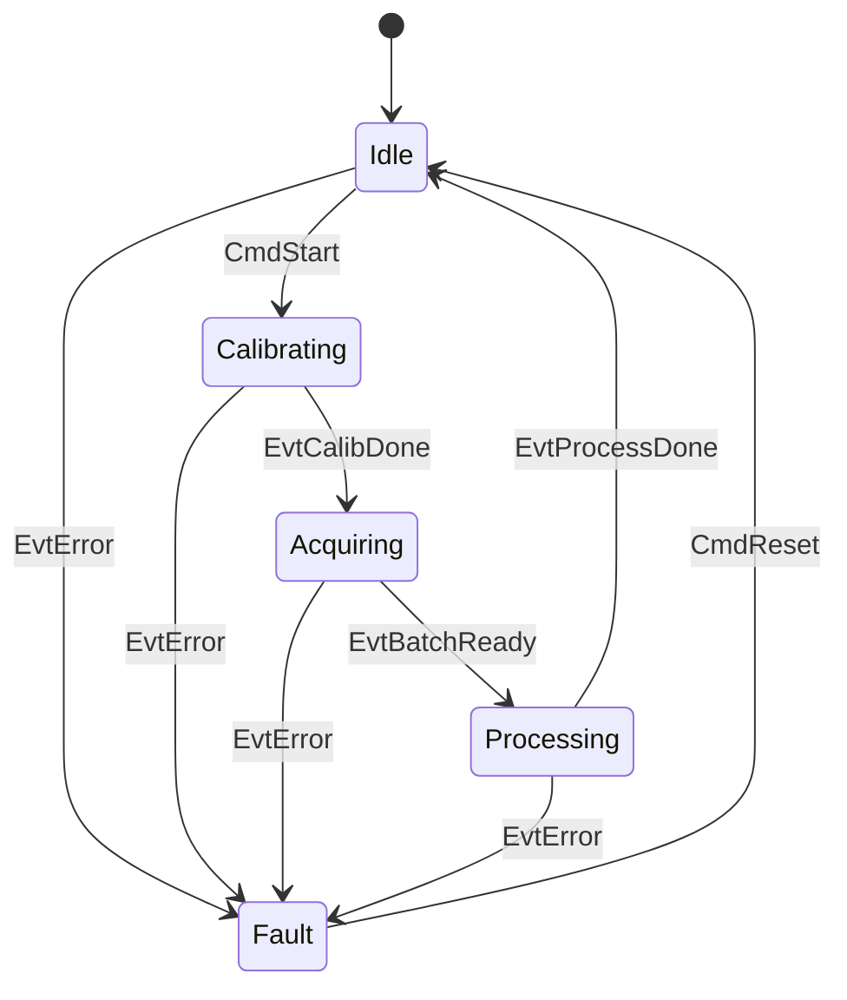
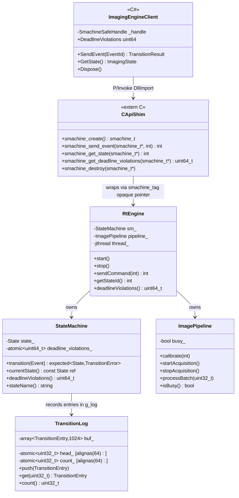

# Medical Imaging State Machine — Architecture

## Overview

Three-layer architecture:

| Layer | Components | Language |
|---|---|---|
| RT Control Plane | `StateMachine`, `TransitionLog`, `RtEngine` | C++23 |
| Pipeline Stub | `ImagePipeline` | C++23 |
| Integration Shim | `c_api` (extern C), `ImagingEngineClient` | C / C# |

---

## State Machine



Valid state transitions are enforced by `StateMachine::transition()` via `std::visit` over a `std::variant<Idle, Calibrating, Acquiring, Processing, Fault>`. Invalid transitions return `std::unexpected(TransitionError::INVALID_TRANSITION)`.

---

## Class Diagram



---

## RT Boundary

The RT control plane communicates synchronously with the C# diagnostic layer via the `extern-C` shim compiled into `libimaging_engine.so`. All imaging state transitions are bounded by `DEADLINE_US = 500 µs`. Telemetry (timing reports, metrics) flows asynchronously over REST at 400–800 ms round-trips, which is fully acceptable for non-real-time dashboards.

See [ADR-001](adr/ADR-001-rt-vs-rest-boundary.md) for the rationale behind this boundary decision.

---

## Module Layout

```
medical_imaging/
├── include/
│   ├── RtConfig.h          Compile-time constants (DEADLINE_US, LOG_CAPACITY, ...)
│   ├── StateMachine.h      State/Event variant types + StateMachine class
│   ├── TransitionLog.h     Lock-free ring-buffer log + TransitionEntry struct
│   ├── ImagePipeline.h     Sensor pipeline stub interface
│   ├── RtEngine.h          100 Hz jthread engine wrapping SM + pipeline
│   └── c_api.h             extern-C opaque API + integer constants
├── src/
│   ├── StateMachine.cpp    std::visit transition table, timing, deadline check
│   ├── TransitionLog.cpp   Atomic push/get/count + g_log definition
│   ├── ImagePipeline.cpp   Stub implementations
│   ├── RtEngine.cpp        timerfd (Linux) / sleep_for (macOS) tick loop
│   ├── c_api.cpp           smachine_tag + 5 C functions
│   └── main.cpp            Demo: start engine, CmdStart, 3s, print state
├── tests/
│   └── test_state_machine.cpp  14 GoogleTests
├── csharp/
│   └── ImagingEngineClient.cs  C# P/Invoke wrapper (no .csproj needed)
├── scripts/
│   └── generate_timing_report.py  P50/P95/P99 Markdown table from CSV
├── docs/
│   ├── ARCHITECTURE.md     (this file)
│   ├── RT-CONSTRAINTS.md   Timing budget and scheduling documentation
│   └── adr/
│       └── ADR-001-rt-vs-rest-boundary.md
└── CMakeLists.txt
```
